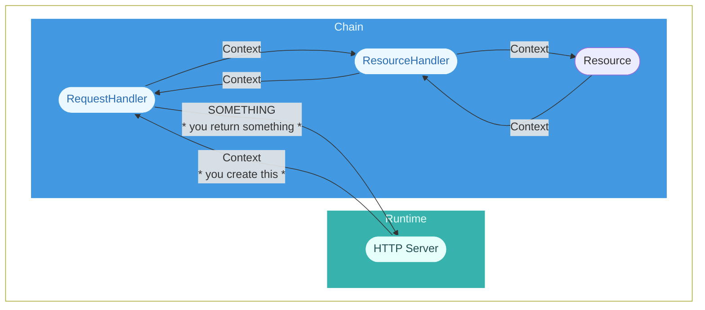

import { Steps, Tab, Tabs, Callout } from "nextra/components";
import { CalloutAsyncChain } from "@/src/components/nextra/CalloutAsyncChain"
import { LinkExternal } from "@/src/components/nextra/LinkExternal"

# About the `ContextChain`

## Why Use This Chain?

Below are some reasons why you would want to use this chain.

- You want your request and response objects contained in a single context object (like <LinkExternal href="https://koajs.com/#context">Koa</LinkExternal> and <LinkExternal href="https://oakserver.github.io/oak/#context">oak</LinkExternal>)

    <details>
      <summary>__Example__</summary>
      <div className="px-7 mt-5">
        You want something like this ...

        ```ts
        class MyResource extends ContextChain.Resource {

          // Handle GET requests
          public GET(context) {

            const request = context.request;   // The request is in the context object
            const response = context.response; // The response is in the context object

            if (doSomething(request)) {
              response.end("Hello");
              return context;
            }

            response.end("Hi");
            return context;
          }

        }
        ```
      </div>
    </details>

- You want to handle extra data (other than the request and response objects) in your application without having long parameter lists

    <details>
      <summary>__Example__</summary>
      <div className="px-7 mt-5">
        You want something like this ...

        ```ts
        class MyResource extends ContextChain.Resource {

          // Handle GET requests
          public GET(context) { ... }

        }
        ```

        ... and not this ...

        ```ts
        class MyResource extends ContextChain.Resource {

          // Handle GET requests
          public GET(request, response, somethingElse, anotherParam, ...rest) { ... }

        }
        ```
      </div>
    </details>

## Handlers

<CalloutAsyncChain />

This chain contains handlers that handle a context object as [explained below](#the-context-object). They receive the context object as inputs and return the context object back as outputs. The handlers are written like:

```ts
export class Handler<Context> {

  /**
   * @param context The `context` object as the input.
   * @returns The `context` object as the output.
   */
  public handle(context: Context): Promise<Context> {
    // ... do some stuff (code is shortened for brevity)

    // ... then return the context object back
    return Promise.resolve(context);
  }
}
```

## The Context Object

This object gets passed between handlers as inputs and outputs. We call it a "context" object because the term "context" is used in other frameworks (like <LinkExternal href="https://koajs.com/#context">Koa</LinkExternal> and <LinkExternal href="https://oakserver.github.io/oak/#context">oak</LinkExternal>). You're in charge of defining this object and it must follow the [Data Type](#data-type) information below so that it works properly in the chain.

### Data Type

This chain expects the context object to contain all of the data necessary to help its handlers (and you) process an HTTP request. The context object ___must match or extend the following data type___:

```ts
type Context = {
  request: {
    method: string; // This property is used to match the request to a resource's HTTP request method
    url: string;    // This property is used to match the request to a resource's path
  };
};
```

In code, the context object could look like:

```ts
// Here is our `Context` data type definition:
type Context = {
  request: {
    method: string; // This property is used to match the request to a resource's HTTP request method
    url: string;    // This property is used to match the request to a resource's path
  };
};

// And here is our context object matching our `Context` data type definition:
const myContextObject: Context = {
  request: {
    url: "http://localhost:1447",
    method: "GET",
  },
};
```

We know the `{ request: { method, url } }` data type above does not fit all use cases. It only includes properties that Drash needs to ensure requests are matched to the correct resource and the resource's correct HTTP method is called. We encourage you to extend the context object to fit your requirements. If you want to see how you can add more properties to the context object, see the [Extending the Context Object](#extending-the-context-object) section below.

### Context Objects in Runtimes

To give you a better idea of how the context object can be defined in different runtimes, below are some examples showing the context object's data type in different runtimes.

<Callout emoji={null} type="info">
Don't worry if you don't understand the code below now. You'll be able to see context objects working in code when you create this chain in the [Steps](./create-the-chain#steps) section on the [Create the Chain](./create-the-chain) page.
</Callout>

<Tabs items={["Node v16.x", "Deno v1.35.x"]}>
<Tab>
Node v16.x's HTTP server gives you a request object of type `IncomingMessage` and a response object of type `ServerResponse`. With this information, you could create a context object with the following data type:

```ts
type NodeContext = {
  request: IncomingMessage,
  response: ServerResponse,
};
```
</Tab>
<Tab>
Deno v1.35.x's HTTP server gives you a request object of type [`Request`](https://developer.mozilla.org/en-US/docs/Web/API/Request), but it doesn't give you a response object. With this information, you could create a context object with the following data type:

```ts
type DenoContext = {
  request: Request,
  // No Response object here because Deno doesn't give you one
};
```

Even though Deno doesn't give you a response object, but you can define one ourselves. You can use any data type you want for the response object, but when you return a response back to Deno, it needs to be in a format that Deno expects (e.g., it should be an object of type [`Response`](https://developer.mozilla.org/en-US/docs/Web/API/Response)).
</Tab>
<Tab>
Buns's HTTP server gives you a request object of type `Request`, so you can define a request property using the `Request` object. It does not give you a response object, so you will have to define it yourself. In the chain, it can be any data type you want, but when you return the response back to Bun, its data type must be one that Bun expects (e.g., `Response`).

```ts
type BunContext = {
  request: Request,
  response?: unknown,
};
```
</Tab>
</Tabs>

### Extending The Context Object

You can add more properties to the context object depending on your use cases, runtime, or other requirements, but it ___must___ contain the properties mentioned above. An example of adding more properties to the context object looks like:

```ts
// Here is our `Context` data type definition with the required properties and more:

type Context = {
  request: {
    method: string; // This property is used to match the request to a resource's HTTP request method
    url: string;    // This property is used to match the request to a resource's path
  };

  response: Response;

  metadata: {
    property_1: string;
    property_2: number;
    // ... and so on
  };

  // ... and so on
};

// And here is a `Context` object with the required properties and more:

const myContextObject: Context = {
  request: {
    method: "GET",
    url: "http://localhost:1447",
  },

  response: new Response(),

  metadata: {
    property_1: "sup",
    property_2: 1337
  },
};
```


## Flow Diagram

The diagram below summarizes how this chain exchanges data.

<div className="tutorials:chains:introduction flowchart-detailed flowchart-4">

</div>

### TLDR

From the `HTTP Server`, you create a `Context` object and pass it to the first handler (`RequestHandler`). The `Context` object will go through the chain and come back. When it comes back, you return `SOMETHING` to the `HTTP Server` which should be a format the `HTTP Server` expects.

### Detailed Explanation

1. As you can see, the runtime's `HTTP Server` must send a `Context` object ([explained above](#the-context-object)) to the chain's first handler (`RequestHandler`).

1. When `RequestHandler` receives the `Context` object, it validates the `Context` object against the data type requirements ([explained above](#data-type)).

    - If not valid, `RequestHandler` throws a `500 Internal Server` error

    - If valid, `RequestHandler` sends the `Context` object to its next handler: `ResourceHandler`

1. When `ResourceHandler` receives the `Context` object, it reads the `Context` object's `request.url` property to find ___the first resource___ that can handle the `Context` object. It does this by matching the `request.url` property to all `paths` properties in all resources.

    - If a resource is not found, `ResourceHandler` throws a `404 Not Found` error.

      <Callout type="info" emoji={null}>
      <strong>NUANCE!</strong> If you're using [Resources > Dynamic Paths](../resources/dynamic-paths), please make sure your resources are in an order that you expect them to handle dynamic paths. `ResourceHandler` uses ___the first resource___ that can handle the `Context` object. For example, this means a resource with `/*` will be used if it is defined before a resource with `/api/*`.
      </Callout>

    - If a resource is found, `ResourceHandler` reads the HTTP request method from the `Context` object (this is the `request.method` property) and checks if the resource has that HTTP request method defined.

        - If the resource has the HTTP request method defined, `ResourceHandler` calls it (e.g., `MyResource.GET(context)`).

        - If the resource doesn't have the HTTP request method defined, the resource's default behavior is performed, which should be a [`501 Not Implemented` error being thrown](../../concepts/resources#the-core-resource) (assuming the resource [extends the chain's base `Resource` class](../../concepts/resources#chain-resource-classes)).

1. When the `Context` object is returned from the chain, you need to return a `SOMETHING` object back to the `HTTP Server`. The data type of this `SOMETHING` object is determined by the runtime. For example:

    - It would be a `Response` object if we were using Deno v1.35.x since Deno v1.35.x's HTTP server expects a `Response` object to be returned to it

    - It would be `void` if we were using Node v16.x since Node v16.x's HTTP server only requires that you call `res.end()` and not return anything to it
