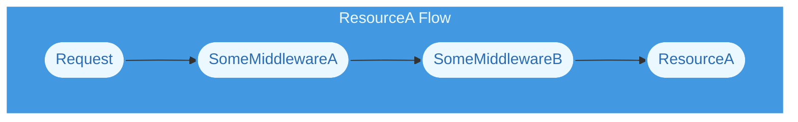
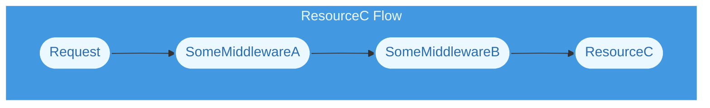

import { Callout, Tabs, Tab } from "nextra/components";
import { LinkExternal } from "@/src/components/nextra/LinkExternal";

# Middleware

<Callout type="info" emoji={null}>
In [v2.x](/drash/v2.x/tutorials/services/basics), we use the term "services" to encapsulate any software used in a Drash application that is not part of Drash's core code. We are changing that definition for v3.x onward. We now use the <LinkExternal href="https://developer.mozilla.org/en-US/docs/Glossary/Middleware">MDN's definition</LinkExternal> to describe middleware.
</Callout>

## Summary

Middleware is software that can run before and after a resource's HTTP method is called. Middleware can be added to resources using a [resource group](./introduction).

The highlighted sections below show how middleware can be added:

<Tabs items={["Deno v1.37.x"]}>

<Tab>

```typescript showLineNumbers  {12-15}
// Code is shortened for brevity

import { Chain, Resource } from "https://esm.sh/@drashland/drash@v3.0.0-beta.1/modules/chains/RequestChain/mod.native.ts";
 
const groupedResources = Resource
  .group()            // Get the class' builder for quickly building a group
  .resources(         // Add these resources
    ResourceA,
    ResourceB,
    ResourceC,
  )
  .middleware(        // Add these middleware classes to each resource
    SomeMiddlewareA,  // During runtime, SomeMiddlewareA will run first, then ...
    SomeMiddlewareB,  // ... SomeMiddlewareB will run, then the resource will be called
  )
  .build();           // Build the group

// Create the chain and add the resource group to it
const chain = Chain
  .builder()
  .resources(groupedResources)
  .build();
```

</Tab>
</Tabs>

## Creating Middleware

### Handling Requests

You can create middleware by extending the Request Chain module's `Middleware` class.

Below is an example of creating a logging middleware that logs GET requests to a resource.

<Tabs items={["Deno v1.37.x"]}>

<Tab>

```typescript showLineNumbers
import { Chain, Middleware, Resource } from "https://esm.sh/@drashland/drash@v3.0.0-beta.1/modules/chains/RequestChain/mod.native.ts";

// Create the resource
class MyResource extends Resource {
    public paths = ["/"];

    public GET(request) {
        return new Response("Hello!");
    }
}

// Create the middleware
class LogGETRequests extends Middleware {
  public GET(request) {
      // Log the request
      //
      // A logging library is a better option, but for educational purposes,
      // a `console.log()` statement will suffice.
      console.log(`Incoming request: ${request.method} ${request.url}`);

      // Call the resource's GET method. `super` will be `MyResource` when
      // they are built in their resource group.
      return super.GET(request);
  }
}

const group = Resource
  .group()
  .resources(MyResource)      // Add the resource to the group

  .middleware(LogGETRequests) // Add the middleware to the group. During the
                              // resource group's build process, this
                              // middleware will end up EXTENDING the
                              // `MyResource` class -- hence the
                              // `super.GET()` call in the resource. `super`
                              // will be `MyResource`, so `super.GET()` will
                              // call `MyResource.GET()`.
  .build();

const chain = Chain
  .builder()
  .resources(group)          // Chains can take in resources and resource groups
  .build();
```

</Tab>
</Tabs>

You might notice that the `LogGETRequests` middleware class has a `GET` method defined (just like a resource). The Request Chain module's `Middleware` class extends the same core `Resource` class that the Request Chain module's `Resource` class extends. This means __all middleware__ classes you create will inherit the same HTTP methods that the Request Chain module's `Resource` class inherits. This also means the following:

- If you want your middleware to handle GET requests, then add a `GET` method to your middleware
- If you want your middleware to handle POST requests, then add a `POST` method to your middleware
- If you want your middleware to handle PUT requests, then add a `PUT` method to your middleware
- ... and so on

### Handling All Requests

Middleware classes also have an `ALL` method. This method allows your middleware to run on __all__ requests to your resource(s) &mdash; hence the method name being `ALL`. Taking the above `LogGETRequests` class, making it log on all requests looks like:

<Tabs items={["Deno v1.37.x"]}>

<Tab>

```typescript showLineNumbers {14}
import { Chain, Middleware, Resource } from "https://esm.sh/@drashland/drash@v3.0.0-beta.1/modules/chains/RequestChain/mod.native.ts";

// Create the resource
class MyResource extends Resource {
    public paths = ["/"];

    public GET(request) {
        return new Response("Hello!");
    }
}

// Create the middleware
class LogGETRequests extends Middleware {
  public ALL(request) {
      // Log the request
      //
      // A logging library is a better option, but for educational purposes,
      // a `console.log()` statement will suffice.
      console.log(`Incoming request: ${request.method} ${request.url}`);

      // Call the resource's GET method. `super` will be `MyResource` when
      // they are built in their resource group.
      return super.GET(request);
  }
}

const group = Resource
  .group()
  .resources(MyResource)      // Add the resource to the group

  .middleware(LogGETRequests) // Add the middleware to the group. During the
                              // resource group's build process, this
                              // middleware will end up EXTENDING the
                              // `MyResource` class -- hence the
                              // `super.GET()` call in the resource. `super`
                              // will be `MyResource`, so `super.GET()` will
                              // call `MyResource.GET()`.
  .build();

const chain = Chain
  .builder()
  .resources(group)          // Chains can take in resources and resource groups
  .build();
```

</Tab>
</Tabs>

The above code will result in `LogGETRequests` logging every request made to `MyResource`.

## Sorting Middleware

Middleware runs in the order you define them (from top-to-bottom or left-to-right depending on how you write your code). For example:

<Tabs items={["Top-to-bottom", "Left-to-right"]}>
<Tab>
```typescript showLineNumbers
// Code is shortened for brevity

const groupedResources = Resource
  .group()
  .resources(
    ResourceA,
    ResourceB,
    ResourceC,
  )
  .middleware(
    SomeMiddlewareA, // This runs first
    SomeMiddlewareB, // This runs second
    SomeMiddlewareC, // This runs third
  )
  .build();
```
</Tab>
<Tab>
```typescript showLineNumbers
// Code is shortened for brevity

const groupedResources = Resource
  .group()
  .resources(
    ResourceA,
    ResourceB,
    ResourceC,
  )
  .middleware(SomeMiddlewareA, SomeMiddlewareB, SomeMiddlewareC)
  //          ^^^^^^^^^^^^^^^  ^^^^^^^^^^^^^^^  ^^^^^^^^^^^^^^^
  //          This runs first  This runs second This runs third
  .build();
```
</Tab>
</Tabs>

## How It Works

### TLDR

When a resource group is built with resources and middleware, the build process takes __all middleware__ and places them around the resources. This allows middleware to run processes before and after a resource's HTTP method is called.

### Detailed Explanation

When a resource group is built with resources and middleware, the build process uses a variant of the <LinkExternal href="https://en.wikipedia.org/wiki/Proxy_pattern">Proxy Pattern</LinkExternal> to place middleware around the resources. This allows middleware to run processes before and after a resource's HTTP method is called like below.

#### Example

This example shows how middleware can:

- block inbound requests to a resource if the `x-auth-token` header is bad;
- send requests to a resource; and
- ensure the response from the resource is tagged with a `x-auth-by` header.

```typescript
class AuthMiddleware extends Middleware {
  public ALL(request: Request) {

    const token = request.headers.get("x-auth-token");

    // No token or not verified? Get out.
    if (!token || !SomeVerificationService.verify(token)) {
      throw new HTTPError(401, `Denied`);
    }

    // Otherwise, do your thing man. Proceed.
    const response = super.GET(request);

    // Alright, before we send the response, let's make sure we tag the response
    // with some identifier that can be used by outbound/upstream processes.
    response.headers.set("x-auth-by", "Drash-Auth-v2.3");

    // Cool. Now we can send the response knowing outbound/upstream processes
    // can identify the request/response as being authorized by Drash-Auth-v2.3.
    return response;
  }
}
```

#### Data Flow

This example shows how data flows from middleware classes to resource classes. The middleware classes below (in the `.middleware()` call) will be placed around `ResourceA`, `ResourceB`, and `ResourceC`. When requests are made to any of the resources, the requests __must go through each middleware__ before being passed to the resource they are targeting.

<Tabs items={["Deno v1.37.x"]}>

<Tab>

```typescript showLineNumbers  {12-15}
// Code is shortened for brevity

import { Chain, Resource } from "https://esm.sh/@drashland/drash@v3.0.0-beta.1/modules/chains/RequestChain/mod.native.ts";
 
const groupedResources = Resource
  .group()            // Get the class' builder for quickly building a group
  .resources(         // Add these resources
    ResourceA,
    ResourceB,
    ResourceC,
  )
  .middleware(        // Add these middleware classes to each resource
    SomeMiddlewareA,  // During runtime, SomeMiddlewareA will run first, then ...
    SomeMiddlewareB,  // ... SomeMiddlewareB will run, then the resource will be called
  )
  .build();           // Build the group

// Create the chain and add the resource group to it
const chain = Chain
  .builder()
  .resources(groupedResources)
  .build();
```

</Tab>
</Tabs>

Taking the above code, the request flows for each resource will be:

<div className="tutorials:chains:introduction flowchart-drash-chain">

</div>

<div className="tutorials:chains:introduction flowchart-drash-chain">

</div>

<div className="tutorials:chains:introduction flowchart-drash-chain">

</div>

As you can see above, requests must go through __all middleware__ before being passed to the resources.
