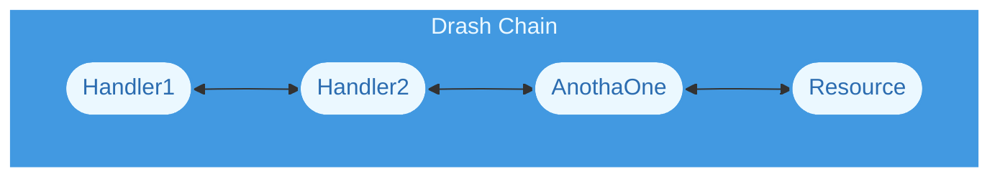

import { Tab, Tabs, Callout } from "nextra/components";
import { LinkExternal } from "@/src/components/nextra/LinkExternal";

# Chains

## What Is a Chain?

In the context of Drash, a chain is a set of handlers that are connected together to form a variant of the <LinkExternal href="https://en.wikipedia.org/wiki/Chain-of-responsibility_pattern">Chain of Responsibility</LinkExternal> pattern. Each handler receives an __input__ and returns an __output__. The chain has one job: to process HTTP requests.

In simplest form, their flow looks like the diagram below:

<div className="tutorials:chains:introduction flowchart-drash-chain">

</div>

When you build applications with Drash, you start by creating a chain. From there, you give it [resources](./resources) &mdash; the classes you use to process requests and respond to those requests.

## Where Is the Chain Placed?

### TLDR

The chain is placed (by you) behind your runtime's HTTP server. This is explained in more detail below.

### Detailed Explanation

After you create a chain, you place it behind your runtime's HTTP server so your runtime's HTTP server can send HTTP requests to it. To visualize how the chain fits into the bigger picture of a system, we can start by looking at just the chain.

A system with just the chain looks like the following:

```mermaid
flowchart LR
    browser([Browser])
    runtimes([HTTP Server])
    h1([Handler1])
    h2([Handler2])
    h3([AnothaOne])
    h4([Resource])

    subgraph lifecycle[ ]
      direction LR
      subgraph client[Client]
        browser
      end
      subgraph runtime[Runtime]
        browser ~~~ runtimes
      end
      subgraph chain[Drash Chain]
        direction LR
        runtimes ~~~ h1 <--> h2 <--> h3 <--> h4
      end
      subgraph external[Some Service]
        h4 ~~~ apiEndpoint([API Endpoint])
      end
    end

    style lifecycle fill:#ffffff,color:#ffffff;
    style external fill:#ffffff,stroke:#ffffff,color:#4299e1;
    style client fill:#fc8181,stroke:#fc8181,stroke-width:2px,color:#fff5f5;
    style runtime fill:#38b2ac,stroke:#38b2ac,stroke-width:2px,color:#e6fffa;
    style chain fill:#4299e1,stroke:#4299e1,stroke-width:2px,color:#ebf8ff;

    classDef red fill:#fff5f5,stroke:#fc8181,stroke-width:2px,color:#c53030;
    classDef green fill:#e6fffa,stroke:#38b2ac,stroke-width:2px,color:#234e52;
    classDef blue fill:#ebf8ff,stroke:#4299e1,stroke-width:2px,color:#2b6cb0;
    classDef ext fill:#ebf8ff,stroke:#4299e1,stroke-width:2px,color:#2b6cb0;

    class browser red
    class runtimes green
    class h1,h2,h3,h4 blue
    class apiEndpoint ext
```

<div className="tutorials:chains:introduction flowchart-detailed flowchart-1">

</div>

This chain is not useful unless it handles HTTP requests. To do that, it needs a runtime like Node, Deno, or Bun, and it needs to connect to the runtime's HTTP server.

 Once it is connected to the runtime's HTTP server, the system looks like:

<div className="tutorials:chains:introduction flowchart-detailed flowchart-2">

</div>

Still, this chain is not useful unless the runtime's HTTP server is running and listening for HTTP requests. Once the HTTP server is running, clients (e.g., browsers) will be allowed to make requests to the HTTP server.

When clients are making requests to the HTTP server, the system looks like:

<div className="tutorials:chains:introduction flowchart-detailed flowchart-3">

</div>

Although the above system can be somewhat of a working system, it doesn't account for dynamic data (e.g., data retrieved from a service like Stripe or database like Postgres). In the real world, systems can connect to other services/systems for data.

A system that connects to other services/systems for data looks like:

```mermaid
flowchart LR
    browser([Browser])
    runtimes([HTTP Server])
    h1([Handler1])
    h2([Handler2])
    h3([AnothaOne])
    h4([Resource])

    subgraph lifecycle[ ]
      direction LR
      subgraph client[Client]
        browser
      end
      subgraph runtime[Runtime]
        browser <--> runtimes
      end
      subgraph chain[Drash Chain]
        direction LR
        runtimes <--> h1 <--> h2 <--> h3 <--> h4
      end
      subgraph external[Some Service]
        h4 <--> apiEndpoint([API Endpoint])
      end
    end

    style lifecycle fill:#ffffff,color:#ffffff;
    style external fill:#ffffff,stroke:#ffffff,color:#4299e1;
    style client fill:#fc8181,stroke:#fc8181,stroke-width:2px,color:#fff5f5;
    style runtime fill:#38b2ac,stroke:#38b2ac,stroke-width:2px,color:#e6fffa;
    style chain fill:#4299e1,stroke:#4299e1,stroke-width:2px,color:#ebf8ff;

    classDef red fill:#fff5f5,stroke:#fc8181,stroke-width:2px,color:#c53030;
    classDef green fill:#e6fffa,stroke:#38b2ac,stroke-width:2px,color:#234e52;
    classDef blue fill:#ebf8ff,stroke:#4299e1,stroke-width:2px,color:#2b6cb0;
    classDef ext fill:#ebf8ff,stroke:#4299e1,stroke-width:2px,color:#2b6cb0;

    class browser red
    class runtimes green
    class h1,h2,h3,h4 blue
    class apiEndpoint ext
```

<div className="tutorials:chains:introduction flowchart-detailed flowchart-4">

</div>

As you can see above, "Some Service" is an API Endpoint that the Drash Chain is making requests to for data. In this system, clients could make requests to the API Endpoint _through_ the runtime's HTTP server and Drash's chain.

## What Data Is Processed?

Drash's chains process the data you give it. This means you are in charge of defining what goes into (and through) the chain and what comes out. The only requirement is the data you give it must:

- be an object;
- have a `url: string` property; and
- have a `method: string` property.

The `url` property needs to be a _fully qualified URL_. For example:

```ts
// Good
const url: string = "http://localhost:1447/accounts/1337";

// Bad
const url: string = "/acconts/1337";
```

The `method` property must be a valid <LinkExternal href="https://developer.mozilla.org/en-US/docs/Web/HTTP/Methods">HTTP request method</LinkExternal>. For example:

```ts
// Uppercase is OK
const method: string = "GET";

// Lowercase is also OK
const method: string = "get";
```

In general, a summary of the data exchange in a system with a client, runtime, Drash chain, and some service looks like:

```mermaid
flowchart
  browser([Browser])
  runtimes([HTTP Server])
  h1([Handler1])
  h2([Handler2])
  h3([AnothaOne])
  h4([Resource])

  subgraph lifecycle[ ]
    direction LR
    subgraph client[Client]
      browser
    end
    subgraph runtime[Runtime]
      browser -- HTTP message --> runtimes
      runtimes -- HTTP message --> browser
    end
    subgraph chain[Drash Chain]
      direction LR
      runtimes -- Input --> h1 -- Input --> h2 -- Input --> h3 -- Input --> h4
      h4 -- Output --> h3 -- Output --> h2 -- Output --> h1
      h1 -- Output --> runtimes
    end
    subgraph external[Some Service]
      h4 -- Some message --> apiEndpoint([API Endpoint])
      apiEndpoint -- Some message --> h4
    end
  end

  style lifecycle fill:#ffffff,color:#ffffff;
  style external fill:#ffffff,stroke:#ffffff,color:#4299e1;
  style client fill:#fc8181,stroke:#fc8181,stroke-width:2px,color:#fff5f5;
  style runtime fill:#38b2ac,stroke:#38b2ac,stroke-width:2px,color:#e6fffa;
  style chain fill:#4299e1,stroke:#4299e1,stroke-width:2px,color:#ebf8ff;

  classDef red fill:#fff5f5,stroke:#fc8181,stroke-width:2px,color:#c53030;
  classDef green fill:#e6fffa,stroke:#38b2ac,stroke-width:2px,color:#234e52;
  classDef blue fill:#ebf8ff,stroke:#4299e1,stroke-width:2px,color:#2b6cb0;
  classDef ext fill:#ebf8ff,stroke:#4299e1,stroke-width:2px,color:#2b6cb0;

  class browser red
  class runtimes green
  class h1,h2,h3,h4 blue
  class apiEndpoint ext
```

<div className="tutorials:chains:introduction flowchart-data">

</div>

- The Client and Runtime exchange [HTTP messages](https://developer.mozilla.org/en-US/docs/Web/HTTP/Messages). This process is defined by the Client and Runtime.
- The Runtime and Drash Chain exchange inputs and outputs. The data types of these inputs and outputs are defined by the Runtime and you. For example, if Runtime was Deno, then the HTTP Server would give you a `Request` object. You can pass this `Request` object to your chain and have your chain return a `Response` object that you can pass to Deno's HTTP Server.
- If Some Service exists, then the data type of the data being exchanged between Some Service and Drash Chain would be defined by Some Service.

## Next Steps

Feel free to follow our recommendation, jump ahead, or navigate the documentation pages at your leisure.

### Our Recommendations

- Read about [how resources play a role in the chain](./resources)

### Want to Jump Ahead?

 - [Create a `RequestChain`](../chains/request-chain/create-the-chain) application
